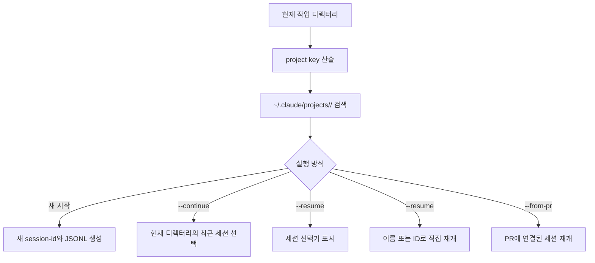
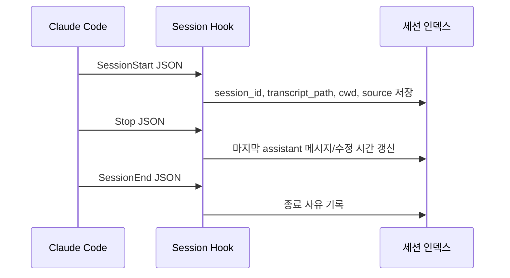

# Claude Code 세션 구성 규칙

## 범위

이 문서는 Claude Code CLI 세션을 탐색, 표시, 재개, 정리하는 프로그램을 만들 때 필요한 로컬 파일 구성 규칙을 요약한다. 공식 문서 기준이며, 데스크톱 앱, 웹, VS Code 확장은 각자 별도 세션 기록을 유지하므로 여기서는 CLI 중심으로 다룬다.

## 핵심 규칙

- 세션은 프로젝트 디렉터리에 묶인 저장된 대화이다.
- 대화, 도구 호출, 도구 결과, 메타데이터는 로컬 JSONL transcript로 계속 저장된다.
- 기본 저장 위치는 `~/.claude/projects/<project>/<session-id>.jsonl`이다.
- `<project>`는 작업 디렉터리 경로에서 파생된다.
- `CLAUDE_CONFIG_DIR`을 설정하면 `~/.claude` 기준 경로가 해당 디렉터리 아래로 이동한다.
- 기본적으로 오래된 로컬 세션 파일은 30일 후 삭제된다. `cleanupPeriodDays` 설정으로 바꿀 수 있다.
- transcript 저장을 끄려면 `CLAUDE_CODE_SKIP_PROMPT_HISTORY`를 설정하거나, 비대화형 모드에서 `--no-session-persistence`를 사용한다.

## 디렉터리 구조

```text
~/.claude/
  CLAUDE.md
  settings.json
  history.jsonl
  projects/
    <project>/
      <session-id>.jsonl
      <session-id>/
        subagents/
        tool-results/
  file-history/
    <session>/
```

주요 의미:

- `projects/<project>/<session-id>.jsonl`: 전체 대화 transcript.
- `projects/<project>/<session-id>/subagents/`: 부모 세션에 딸린 subagent transcript.
- `projects/<project>/<session-id>/tool-results/`: 큰 도구 출력이 분리 저장되는 위치.
- `file-history/<session>/`: Claude가 수정하기 전 파일 스냅샷. checkpoint restore에 사용된다.
- `history.jsonl`: 프롬프트 입력 히스토리.

## 세션 시작과 재개



재개 규칙:

- `claude --continue`: 현재 디렉터리의 가장 최근 세션을 재개한다.
- `claude --resume`: 세션 선택기를 연다.
- `claude --resume <name>`: 이름이 정확히 일치하면 직접 재개하고, 모호하면 선택기를 연다.
- `/resume`: 실행 중인 세션 안에서 다른 대화로 전환한다.
- `claude -p` 또는 Agent SDK로 만든 세션은 세션 선택기에 나타나지 않을 수 있지만, 세션 ID를 알면 `claude --resume <session-id>`로 재개할 수 있다.

## 세션 선택기 검색 범위

- 기본 범위는 현재 worktree의 interactive 세션이다.
- 현재 디렉터리를 `/add-dir`로 추가한 다른 세션도 표시될 수 있다.
- 선택기에서 `Ctrl+W`는 같은 저장소의 모든 worktree로 범위를 넓힌다.
- 선택기에서 `Ctrl+A`는 머신의 모든 프로젝트로 범위를 넓힌다.
- 다른 worktree의 세션은 그 위치에서 재개된다.
- 무관한 프로젝트의 세션을 선택하면 `cd`와 resume 명령을 클립보드에 복사한다.

## 이름, 분기, 동시 실행

- 시작 시 `claude -n auth-refactor`로 이름을 지정할 수 있다.
- 세션 중 `/rename auth-refactor`로 이름을 바꿀 수 있다.
- 세션 선택기에서 `Ctrl+R`로 이름을 바꿀 수 있다.
- `/branch <name>` 또는 `--fork-session`은 기존 transcript를 복사해 새 세션 ID로 분기한다.
- 같은 세션을 두 터미널에서 동시에 재개하면 메시지가 하나의 transcript에 섞인다. 세션 관리자에서는 이를 위험 상태로 표시하는 것이 좋다.
- “allow for this session”으로 승인한 권한은 분기 세션에 이월되지 않는다.

## 컨텍스트와 압축

- 새 세션은 이전 대화 기록 없이 새 context window로 시작한다.
- 재개는 같은 세션 ID 아래 기존 transcript에 새 메시지를 append한다.
- `/clear`: 컨텍스트를 비우지만 이전 대화는 저장되어 재개 가능하다.
- `/compact [instructions]`: 이전 히스토리를 요약으로 대체한다.
- `/context`: 현재 context window 소비 내역을 보여준다.
- persistent 규칙은 대화에만 두지 말고 `CLAUDE.md`에 둬야 한다.
- project root의 `CLAUDE.md`는 compact 이후 다시 읽혀 재주입된다.

## Hook 기반 세션 추적

세션 관리자에서 실시간 인덱싱을 하려면 hook을 사용할 수 있다.



주요 입력 필드:

- 공통: `session_id`, `transcript_path`, `cwd`, `hook_event_name`.
- `SessionStart`: `source`가 `startup`, `resume`, `clear`, `compact` 중 하나이고, `model`이 포함된다.
- `Stop`: `last_assistant_message`, `stop_hook_active`가 포함된다.
- `SessionEnd`: 종료 `reason`이 포함된다.

## 구현 시 주의점

- JSONL 각 줄은 메시지, 도구 사용, 도구 결과, 메타데이터 중 하나일 수 있으므로 느슨한 enum으로 파싱한다.
- 큰 도구 출력은 transcript 안이 아니라 `tool-results/`에 있을 수 있다.
- 세션 파일은 로컬 파일이며 다른 호스트로 옮겨도 같은 cwd 기반 경로가 맞아야 안정적으로 resume된다.
- `cleanupPeriodDays`에 따라 파일이 자동 삭제될 수 있으므로 인덱스는 missing file을 정상 상태로 다뤄야 한다.
- 사용자가 `CLAUDE_CONFIG_DIR`을 설정한 경우 기본 홈 경로를 하드코딩하면 안 된다.

## 참고 자료

- Claude Code Docs: Manage sessions, https://code.claude.com/docs/en/sessions
- Claude Code Docs: Explore the `.claude` directory, https://code.claude.com/docs/en/claude-directory
- Claude Code Docs: Settings, https://code.claude.com/docs/en/settings
- Claude Code Docs: Hooks reference, https://code.claude.com/docs/en/hooks
- Claude Code Docs: How Claude Code works, https://code.claude.com/docs/en/how-claude-code-works
