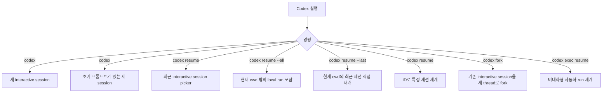
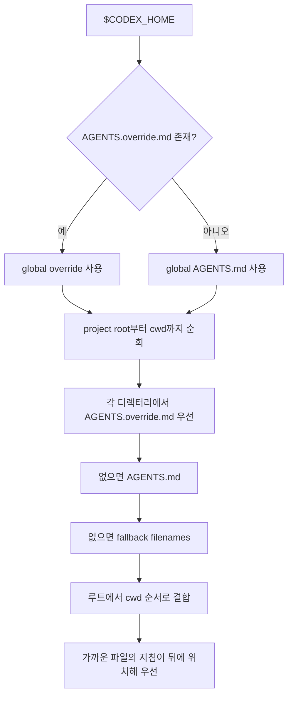

# Codex 세션 구성 규칙

## 범위

이 문서는 OpenAI Codex CLI와 IDE 확장의 로컬 세션, thread, 설정, instruction discovery 규칙을 정리한다. Codex 앱, 웹, 클라우드 작업은 별도 표면이므로 로컬 세션 관리자 구현에 필요한 공통 로컬 규칙 중심으로 다룬다.

## 핵심 용어

- Codex에서 thread는 하나의 세션이다.
- thread는 사용자의 프롬프트, 모델 응답, 도구 호출, 계획 기록, 승인 상태를 포함한다.
- thread는 여러 프롬프트를 포함할 수 있고, 나중에 resume할 수 있다.
- Codex는 여러 thread를 동시에 실행할 수 있지만 같은 파일을 두 thread가 동시에 수정하지 않도록 관리해야 한다.

## 로컬 상태 위치

기본 Codex home은 `~/.codex`이며, `CODEX_HOME`으로 바꿀 수 있다.

```text
$CODEX_HOME/
  config.toml
  auth.json
  history.jsonl
  sessions/
    <session-id 또는 내부 분류 경로>...
  log/
  AGENTS.md
  AGENTS.override.md
```

공식 매뉴얼이 명시하는 주요 파일:

- `config.toml`: 사용자 기본 설정.
- `auth.json`: 파일 기반 인증 저장소를 사용할 때 생성되는 credential cache.
- `history.jsonl`: history persistence가 켜진 경우의 입력 히스토리.
- `sessions/`: 로컬 transcript가 저장되는 위치. 세션 ID는 picker, `/status`, 또는 `~/.codex/sessions/`의 파일에서 확인할 수 있다.
- `log/`: 로그와 캐시류 상태.

## 세션 재개 규칙



세부 규칙:

- `codex resume`은 최근 interactive 세션 picker를 연다.
- `codex resume --all`은 현재 작업 디렉터리 밖의 local run도 보여준다.
- `codex resume --last`는 현재 작업 디렉터리의 가장 최근 세션을 바로 연다.
- `codex resume <SESSION_ID>`는 특정 세션을 ID로 재개한다.
- `codex exec resume --last "..."`와 `codex exec resume <SESSION_ID> "..."`는 non-interactive 자동화 run에서도 resume을 지원한다.
- resume된 run은 원래 transcript, plan history, approvals를 유지한다.
- resume 전에 작업 위치를 바꿔야 하면 `--cd`를 사용하고, 추가 루트를 열어야 하면 `--add-dir`를 사용한다.

## 작업 디렉터리와 프로젝트 설정

Codex는 현재 작업 디렉터리에서 프로젝트 루트를 찾고, 설정과 instruction 파일을 계층적으로 읽는다.

설정 우선순위는 높은 순서로 다음과 같다.

1. CLI flags와 `--config` overrides.
2. 프로젝트 `.codex/config.toml` 파일들. 프로젝트 루트에서 현재 작업 디렉터리까지 내려오며, 더 가까운 파일이 이긴다. 단, trusted project에서만 로드된다.
3. `--profile profile-name`으로 선택한 `$CODEX_HOME/profile-name.config.toml`.
4. 사용자 `$CODEX_HOME/config.toml`.
5. Unix의 `/etc/codex/config.toml` 같은 system config.
6. built-in defaults.

주의:

- 프로젝트가 untrusted이면 프로젝트 `.codex/` 계층 전체가 무시된다. 여기에는 project-local config, hooks, rules가 포함된다.
- 프로젝트 `.codex/config.toml` 안의 상대 경로는 해당 `config.toml`을 담은 `.codex/` 폴더 기준으로 해석된다.
- workspace-write 모드에서 `.git/`과 `.codex/`는 보호 경로로 취급될 수 있다.

## AGENTS.md instruction discovery

Codex는 작업 시작 전에 instruction chain을 만든다. TUI에서는 보통 세션 시작마다 한 번 구성된다.



규칙:

- Global scope는 `$CODEX_HOME/AGENTS.override.md`가 있으면 그것만 사용하고, 없으면 `$CODEX_HOME/AGENTS.md`를 사용한다.
- Project scope는 project root부터 cwd까지 내려오며 각 디렉터리에서 최대 하나의 instruction 파일을 포함한다.
- 검색 순서는 `AGENTS.override.md`, `AGENTS.md`, `project_doc_fallback_filenames`에 지정한 이름 순서다.
- 빈 파일은 건너뛴다.
- 결합된 instruction은 `project_doc_max_bytes` 한도까지 포함된다. 기본값은 32 KiB다.

## context window와 compact

- 모든 thread 정보는 모델 context window 안에 들어가야 한다.
- Codex는 남은 context 공간을 추적하고 보고한다.
- 긴 작업에서는 관련 정보를 요약하고 덜 중요한 내용을 버리는 compact를 수행할 수 있다.
- 반복 compaction을 통해 긴 작업을 여러 단계로 이어갈 수 있다.
- 세션 관리자에서는 compact 전후의 transcript를 원문 대화와 동일하게만 가정하지 말고 “요약으로 대체된 구간”이 있을 수 있음을 반영해야 한다.

## 인증 세션과 보안

- CLI에서 유효한 세션이 없으면 ChatGPT 로그인 경로가 기본이다.
- API key 로그인도 지원한다.
- 로그인 cache는 `$CODEX_HOME/auth.json` 또는 OS credential store에 저장된다.
- `cli_auth_credentials_store`로 `file`, `keyring`, `auto` 중 저장 방식을 고를 수 있다.
- `auth.json`은 access token을 담을 수 있으므로 세션 관리자에서 절대 일반 metadata로 노출하거나 git에 포함하면 안 된다.

## 구현 시 주의점

- `$CODEX_HOME` 환경변수를 먼저 확인하고, 없으면 `~/.codex`를 사용한다.
- 세션 ID는 picker, `/status`, `~/.codex/sessions/` 파일에서 얻을 수 있다.
- 현재 cwd 기준 필터와 `--all` 필터가 다르므로 UI에서도 “현재 프로젝트”와 “전체 로컬” 범위를 분리한다.
- resume은 원 transcript와 승인 기록을 유지하므로, 민감한 승인 상태를 요약 표시할 때 주의한다.
- 프로젝트 trust 상태에 따라 `.codex/config.toml`, hooks, rules가 로드되지 않을 수 있다. 세션 표시에서 “예상 설정”과 “실제 적용 설정”을 혼동하면 안 된다.

## 참고 자료

- OpenAI Codex Manual: Authentication and sessions, https://developers.openai.com/codex/codex-manual.md
- OpenAI Codex Manual: Config basics, https://developers.openai.com/codex/codex-manual.md
- OpenAI Codex Manual: Codex CLI features, https://developers.openai.com/codex/codex-manual.md
- OpenAI Codex Manual: Custom instructions with AGENTS.md, https://developers.openai.com/codex/codex-manual.md
