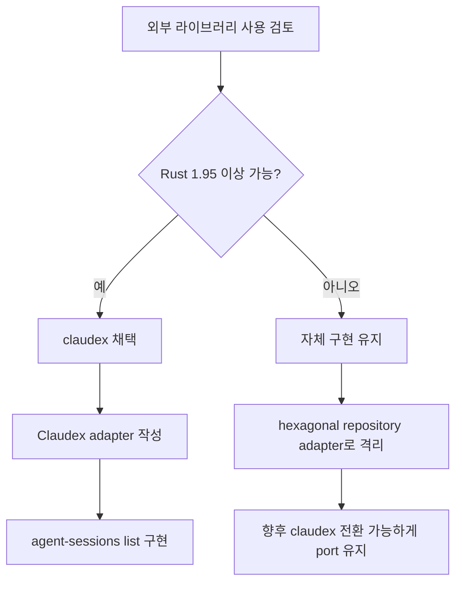

# 외부 라이브러리 적합성 조사

## 요구사항 재정리

목표 CLI는 다음 형태를 지원해야 한다.

```sh
agent-sessions list --agent { claude | codex | pi }
agent-sessions list --agent { claude | codex | pi } --path <path>
agent-sessions list --agent { claude | codex | pi } --all
```

라이브러리 요구사항:

- Claude Code, Codex, Pi 세션을 모두 조회할 수 있어야 한다.
- Rust CLI에서 재사용 가능해야 한다.
- `--path <path>` 필터를 구현할 수 있도록 프로젝트/cwd 정보를 노출해야 한다.
- 세션 ID, transcript 파일 경로, 메시지 수, 최근 수정/활동 시각을 얻을 수 있어야 한다.
- 라이브러리 API가 있거나, 최소한 안정적인 파서/인덱서로 사용할 수 있어야 한다.

## 조사 후보 요약

| 후보 | 언어/형태 | 지원 에이전트 | 라이브러리성 | 결론 |
| --- | --- | --- | --- | --- |
| `claudex` crate | Rust library | Claude, Codex, Pi, OpenClaw | 높음 | 기능상 1순위. 단 현재 crate는 Rust 1.95 필요 |
| `polpo` | TypeScript app/server | Claude, Codex, Pi, Gemini, OpenCode, Goose | 낮음 | 구현 참고용. Rust library로 쓰기 부적합 |
| `find-session` | Python CLI/package | Claude, Codex, OpenCode | 중간 | Pi 미지원. Rust CLI에서 직접 의존하기 부적합 |
| Pi 공식 SDK `@earendil-works/pi-coding-agent` | TypeScript SDK | Pi | 높음 | Pi 전용으로는 적합. 다중 에이전트 공통 요구에는 부족 |
| Pi session manager extensions | Pi extension | Pi | 낮음~중간 | Pi 내부 extension용. 외부 Rust CLI에 부적합 |
| `transession` crate | Rust library | Claude, Codex | 중간 | 세션 변환 목적. Pi 미지원 |
| `memorph` crate | Rust CLI/library 성격 | Claude, Codex, OpenCode | 중간 | 변환/이식 목적. Pi 미지원 |
| `aicx-parser` crate | Rust parser | Claude, Codex 등 | 중간 | BUSL-1.1 라이선스와 Pi 미지원이 문제 |

## 1순위 후보: `claudex`

### 확인 내용

`cargo info claudex` 결과:

- crate: `claudex`
- version: `0.10.0`
- license: MIT
- 설명: “Reusable library for indexing and querying Claude Code, Codex, Pi, and OpenClaw coding sessions”
- repository: `https://github.com/utensils/claudex`
- documentation/homepage: `https://utensils.io/claudex/`
- `rust-version`: 1.95

공개 API에서 확인한 핵심 타입:

```rust
use claudex::api::{Claudex, ClaudexConfig};

let mut claudex = Claudex::new()?;
claudex.ensure_fresh()?;
let sessions = claudex.sessions(None, None, Filter::default(), 100)?;
```

`IndexedSession`은 다음 정보를 제공한다.

```rust
pub struct IndexedSession {
    pub provider: String,
    pub project_name: String,
    pub session_id: Option<String>,
    pub file_path: String,
    pub first_timestamp_ms: Option<i64>,
    pub last_timestamp_ms: Option<i64>,
    pub message_count: i64,
    pub model: Option<String>,
    pub present_on_disk: bool,
}
```

### 요구사항 적합도

장점:

- Rust library라 현재 CLI와 가장 자연스럽게 결합할 수 있다.
- Claude, Codex, Pi를 모두 지원한다.
- SQLite 기반 인덱스를 제공해 대량 세션 조회와 검색에 유리하다.
- provider abstraction이 있어 향후 OpenClaw 등으로 확장하기 쉽다.
- MIT 라이선스라 재사용 리스크가 낮다.
- 비용, 모델, 도구, 검색 같은 확장 기능도 이미 갖고 있다.

단점:

- 현재 공개 버전 `0.10.0`은 `rust-version = 1.95`를 요구한다.
- 현재 개발 환경은 `rustc 1.89.0`이다.
- crates.io에서 `0.9.x` 같은 이전 호환 버전을 바로 조회할 수 없었다.
- 우리 CLI 요구사항의 `--path <path>`는 `project_name` 기반 필터로 매핑해야 하는데, 실제 cwd 원문이 항상 그대로 노출되는지는 추가 검증이 필요하다.

### 결론

기능적으로는 `claudex`가 가장 적합하다. 단, 현재 toolchain 정책이 Rust 1.89 고정이면 직접 의존은 보류해야 한다. Rust 1.95 이상으로 올릴 수 있으면 이 프로젝트는 자체 JSONL 파서를 버리고 `claudex` adapter를 작성하는 방향이 맞다.

권장 판단:

1. Rust 1.95 이상 사용 가능: `claudex` 채택.
2. Rust 1.89 유지 필요: 자체 adapter 유지. 단, `claudex`의 공개 모델과 provider abstraction을 참고한다.

## `polpo`

### 확인 내용

`polpo`는 Claude Code, Codex, Gemini, OpenCode, Pi, Goose를 지원하는 TypeScript/Node 기반 remote control/server 프로젝트다. README에서 다음 세션 위치를 감시한다고 설명한다.

- Claude Code: `~/.claude/projects/<project-slug>/*.jsonl`
- Codex CLI: `~/.codex/sessions/*.jsonl`
- Pi: `~/.pi/agent/sessions/--<cwd-dashes>--/*.jsonl`

또한 session browser와 resume 기능을 제공한다.

### 평가

장점:

- 다중 에이전트 지원 범위가 넓다.
- auto-discovery와 watcher 설계가 참고 가치가 높다.
- 실제 세션 브라우저 요구사항과 유사하다.

단점:

- Rust library가 아니라 서버/앱이다.
- API가 세션 파서 라이브러리로 안정화되어 있다고 보기 어렵다.
- 우리 CLI가 내부 라이브러리로 링크해 쓰기 어렵다.
- Node 프로세스를 별도로 띄우는 방식은 배포/오류면이 커진다.

결론: 구현 참고용으로는 좋지만 직접 채택할 라이브러리는 아니다.

## `find-session`

### 확인 내용

PyPI package이며 Claude Code, Codex, OpenCode 세션 검색을 지원한다.

지원 표:

- Claude Code: `~/.claude/projects/`
- Codex: `~/.codex/sessions/`
- OpenCode: SQLite database

### 평가

장점:

- CLI UX가 현재 요구와 유사하다.
- Claude/Codex 세션 검색과 resume command 생성에는 적합하다.

단점:

- Pi를 지원하지 않는다.
- Python package라 Rust library로 직접 재사용하기 어렵다.
- 목적이 “검색해서 resume”에 가깝고, 재사용 가능한 typed domain API가 핵심은 아니다.

결론: 다중 에이전트 요구사항에서 탈락.

## Pi 공식 SDK: `@earendil-works/pi-coding-agent`

### 확인 내용

NPM package이며 `SessionManager`를 공식 SDK로 노출한다.

문서상 API:

```ts
import { SessionManager } from "@earendil-works/pi-coding-agent";

const currentProjectSessions = await SessionManager.list(process.cwd());
const allSessions = await SessionManager.listAll(process.cwd());
const opened = SessionManager.open("/path/to/session.jsonl");
```

### 평가

장점:

- Pi 세션에는 가장 정확한 공식 구현이다.
- Pi의 tree 구조, compaction, branch, session_info 규칙을 직접 반영한다.
- TypeScript definitions가 제공된다.

단점:

- Pi 전용이다.
- Rust CLI에서 사용하려면 Node bridge나 별도 helper process가 필요하다.
- Claude/Codex까지 통합하려면 결국 별도 구현이 필요하다.

결론: Pi만 대상으로 하면 채택할 수 있지만, 이 프로젝트의 공통 Rust 라이브러리에는 직접 채택하지 않는다.

## Pi session manager extensions

조사된 후보:

- `@agnishc/edb-session-manager`
- `pi-session-manager`

특징:

- Pi 내부 extension으로 `/sessions` overlay를 제공한다.
- Pi의 `SessionManager.list()` 또는 `SessionManager.listAll()`를 사용한다.
- browse, resume, rename, delete 기능을 제공한다.

평가:

- Pi TUI 안에서 쓰기 위한 extension이다.
- 외부 Rust CLI의 라이브러리로 가져다 쓰기 어렵다.
- Claude/Codex는 지원하지 않는다.

결론: 직접 채택하지 않는다.

## Rust 대체 후보

### `transession`

- 목적: Codex, Claude Code, portable IR 간 세션 변환.
- 장점: Rust, MIT, rust-version 1.87.
- 단점: Pi 미지원. 조회/목록 중심 라이브러리가 아니라 변환 중심.

### `memorph`

- 목적: Claude Code, Codex, OpenCode 세션 convert/import/export.
- 장점: Rust, MIT.
- 단점: Pi 미지원. 현재 요구인 단순 list API와는 목적이 다르다.

### `aicx-parser`

- 목적: Claude, Codex, Gemini 등 transcript parser/chunker.
- 장점: Rust parser로 일부 요구에 맞다.
- 단점: Pi 미지원. 라이선스가 `BUSL-1.1`이라 일반 CLI 라이브러리 의존성으로 부적합하다.

## 최종 판단



현재 환경 기준 결론:

- “적합한 외부 라이브러리”는 있다. `claudex`가 가장 적합하다.
- 하지만 현재 Rust 1.89 환경에서는 `claudex 0.10.0`의 MSRV 1.95 요구 때문에 바로 채택하면 빌드가 깨진다.
- 따라서 두 가지 선택지가 있다.

권장 선택:

1. 프로젝트가 Rust toolchain 업그레이드를 허용한다면 `claudex`를 채택한다.
2. Rust 1.89 호환성을 유지해야 한다면 새로 작성한다. 이때 hexagonal architecture의 outbound adapter로 자체 JSONL 스캐너를 두고, 나중에 `ClaudexSessionRepository`로 교체 가능하게 만든다.

## 이 프로젝트의 적용 방침

현재 작업 환경은 `rustc 1.89.0`이다. 사용자의 별도 승인 없이 프로젝트 MSRV를 1.95로 올리는 것은 빌드 가능성을 해칠 수 있으므로, 기본 방침은 다음과 같다.

- hexagonal architecture는 유지한다.
- application port는 `SessionRepository`로 고정한다.
- 기본 adapter는 자체 filesystem JSONL scanner로 작성한다.
- 문서와 코드 구조상 향후 `claudex` adapter를 추가할 수 있게 둔다.
- 사용자가 Rust 1.95 이상을 허용하면 `claudex` adapter로 전환한다.

## 참고 자료

- `claudex` crate: https://crates.io/crates/claudex
- `claudex` repository: https://github.com/utensils/claudex
- `polpo`: https://github.com/pugliatechs/polpo
- `find-session`: https://pypi.org/project/find-session/
- Pi SDK docs: https://github.com/earendil-works/pi/blob/main/packages/coding-agent/docs/sdk.md
- Pi package `@agnishc/edb-session-manager`: https://pi.dev/packages/%40agnishc/edb-session-manager
