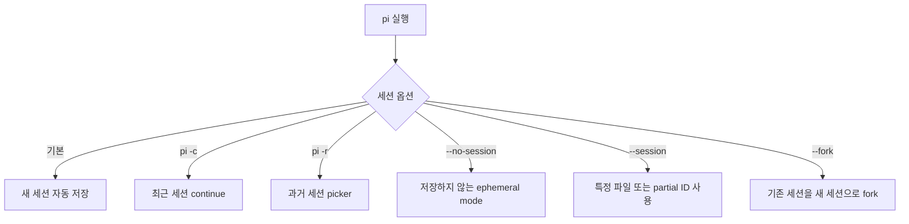
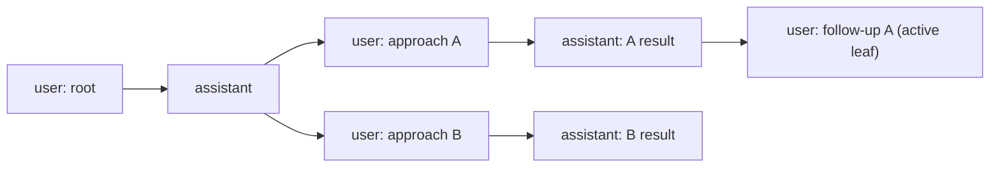
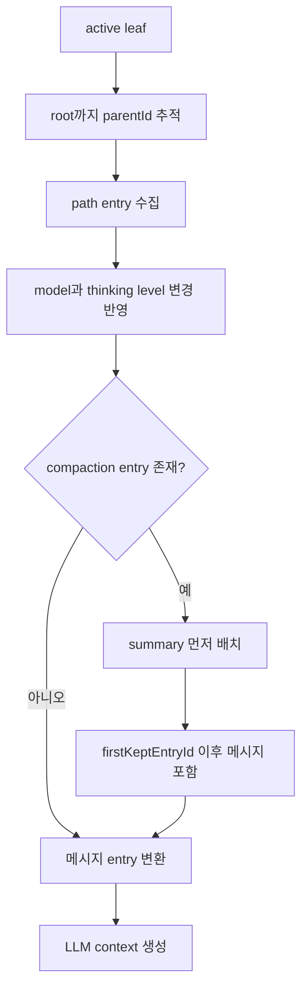

# Pi Coding Agent 세션 구성 규칙

## 범위

이 문서는 Pi Coding Agent의 세션 저장 위치, JSONL 포맷, 트리 기반 분기, 재개, 삭제 규칙을 정리한다. Pi는 `pi` 명령으로 실행되는 오픈소스 터미널 coding agent이며, 각 대화를 session으로 저장한다.

## 핵심 규칙

- Pi는 대화를 자동으로 세션으로 저장한다.
- 기본 세션 저장 위치는 `~/.pi/agent/sessions/`이다.
- 세션은 작업 디렉터리별로 정리된다.
- 각 세션은 JSONL 파일 하나이며, 각 줄은 `type` 필드가 있는 JSON 객체다.
- 최신 세션 포맷은 version 3이다.
- version 2부터 `id`와 `parentId`로 entry tree를 구성한다.
- 기존 session은 load 시 현재 버전으로 자동 migration된다.

## 파일 위치

```text
~/.pi/agent/sessions/
  --<path>--/
    <timestamp>_<uuid>.jsonl
```

`<path>` 규칙:

- 작업 디렉터리 경로에서 `/`를 `-`로 바꾼 값이다.
- 예를 들어 `/Users/me/project`는 대략 `--Users-me-project--` 형태의 디렉터리로 저장된다.

세션 디렉터리는 설정으로 바꿀 수 있다.

- `--session-dir`
- `PI_CODING_AGENT_SESSION_DIR`
- `settings.json`의 `sessionDir`

우선순위는 `--session-dir`이 가장 높고, 그 다음 `PI_CODING_AGENT_SESSION_DIR`, 마지막이 `sessionDir`이다.

## CLI와 slash command



interactive command:

- `/resume`: 이전 세션을 찾아 선택한다.
- `/new`: 새 세션을 시작한다.
- `/name <name>`: 현재 세션 display name을 설정한다.
- `/session`: 현재 세션 파일, 세션 ID, 메시지 수, 토큰, 비용을 표시한다.
- `/tree`: 현재 세션 트리를 탐색한다.
- `/fork`: 이전 user message에서 새 세션을 만든다.
- `/clone`: 현재 active branch를 새 세션으로 복제한다.
- `/compact [prompt]`: 오래된 context를 요약한다.
- `/export [file]`: 세션을 HTML로 export한다.
- `/share`: private GitHub gist로 업로드하고 공유 가능한 HTML 링크를 만든다.

## JSONL 포맷

첫 줄은 session header이며 tree entry가 아니다.

```json
{"type":"session","version":3,"id":"uuid","timestamp":"2024-12-03T14:00:00.000Z","cwd":"/path/to/project"}
```

fork, clone, `newSession({ parentSession })`으로 생성된 세션은 `parentSession`을 포함할 수 있다.

```json
{"type":"session","version":3,"id":"uuid","timestamp":"2024-12-03T14:00:00.000Z","cwd":"/path/to/project","parentSession":"/path/to/original/session.jsonl"}
```

header를 제외한 모든 entry의 공통 필드:

```ts
interface SessionEntryBase {
  type: string;
  id: string;
  parentId: string | null;
  timestamp: string;
}
```

주요 entry type:

- `message`: user, assistant, toolResult, bashExecution 등 agent message를 담는다.
- `model_change`: 세션 중 모델이 바뀐 시점을 기록한다.
- `thinking_level_change`: reasoning/thinking level 변경을 기록한다.
- `compaction`: context 압축 summary와 유지 시작 entry를 기록한다.
- `branch_summary`: `/tree`로 다른 branch로 이동할 때 버린 branch의 요약을 기록한다.
- `custom`: extension 상태 저장용이며 LLM context에는 들어가지 않는다.
- `custom_message`: extension이 주입한 메시지이며 LLM context에 들어간다.
- `label`: entry에 사용자 정의 bookmark 또는 marker를 붙인다.
- `session_info`: session display name 같은 metadata를 기록한다.

## 트리 구조와 branch



규칙:

- 첫 entry는 `parentId: null`이다.
- 이후 entry는 부모 entry ID를 `parentId`로 참조한다.
- 현재 위치는 active leaf다.
- `/tree`는 같은 파일 안에서 leaf를 과거 entry로 이동시켜 새 branch를 만든다.
- `/fork`와 `/clone`은 새 세션 파일을 만든다.
- `/tree`로 branch를 바꿀 때 abandoned branch의 요약을 새 위치에 붙일 수 있다.

## context building

Pi의 `buildSessionContext()`는 현재 leaf에서 root까지의 path를 따라 LLM에 전달할 메시지 목록을 만든다.



중요한 구현 포인트:

- 세션 파일 전체가 항상 LLM context가 되는 것은 아니다.
- 현재 active leaf에서 root까지 이어지는 path가 context의 기본이다.
- `compaction`이 있으면 이전 상세 대화 대신 summary가 들어간다.
- `custom` entry는 상태 저장용이므로 context에 포함하지 않는다.
- `custom_message`와 `branch_summary`는 context message로 변환될 수 있다.

## 삭제와 보존

- 세션은 `~/.pi/agent/sessions/` 아래 `.jsonl` 파일을 삭제하면 제거된다.
- `/resume` picker에서 세션을 선택하고 `Ctrl+D` 후 확인하면 삭제할 수 있다.
- 가능한 경우 Pi는 영구 삭제 대신 `trash` CLI를 사용한다.
- 세션 관리자는 직접 삭제 전에 휴지통 이동 가능 여부를 확인하거나, 사용자가 선택할 수 있게 해야 한다.

## 구현 시 주의점

- partial session ID와 파일 경로를 모두 입력으로 받을 수 있다.
- 같은 파일 안에서 여러 branch가 존재할 수 있으므로 “세션 파일 1개 = 선형 대화 1개”로 가정하면 안 된다.
- session name은 header가 아니라 최신 `session_info` entry에서 결정된다.
- 현재 위치인 leaf가 중요하므로 parser는 entry list뿐 아니라 parent-child index도 만들어야 한다.
- version 1 legacy 파일은 load 시 migration될 수 있으므로, 직접 파싱할 때는 version별 호환 계층을 둔다.
- `bashExecution` message에는 긴 출력 경로, truncation, context 제외 여부가 있을 수 있다.

## 참고 자료

- Pi Docs: Sessions, https://pi.dev/docs/latest/sessions
- Pi Docs: Session File Format, https://pi.dev/docs/latest/session-format
- Pi GitHub: settings.md, https://github.com/earendil-works/pi/blob/main/packages/coding-agent/docs/settings.md
