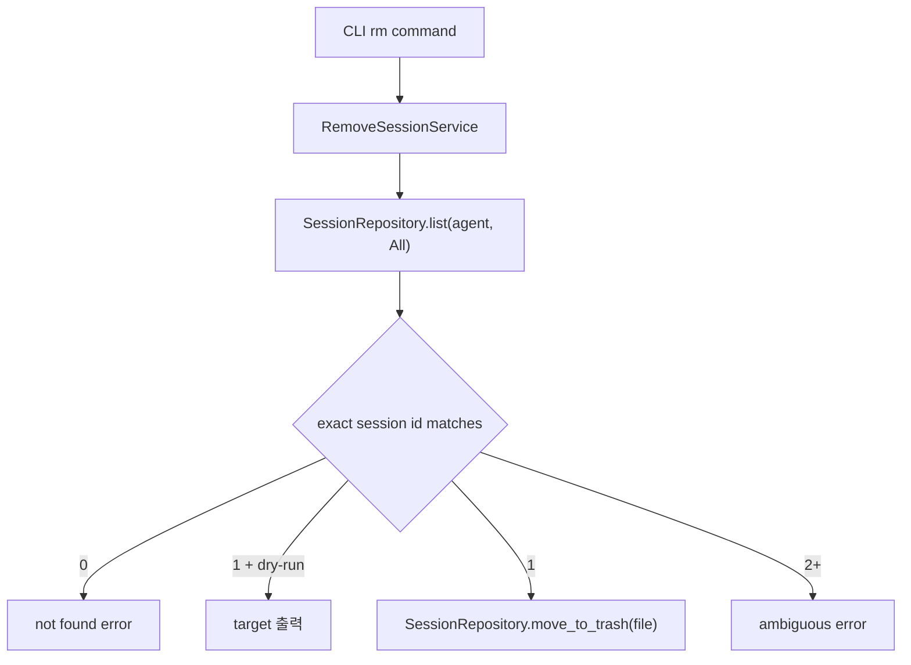

# 세션 삭제 기능

## 명령

```sh
agent-sessions rm --agent <claude|codex|pi> --session-id <session-id>
agent-sessions rm --agent <claude|codex|pi> --session-id <session-id> --dry-run
```

## 1차 구현 범위

- `--agent`는 필수다.
- `--session-id`는 필수다.
- session id는 exact match만 지원한다.
- 정확히 1개 세션이 매칭되면 transcript `.jsonl` 파일을 시스템 휴지통으로 이동한다.
- `--dry-run`이면 삭제하지 않고 대상 파일만 출력한다.
- 0개가 매칭되면 에러를 반환한다.
- 2개 이상 매칭되면 ambiguity 에러를 반환하고 삭제하지 않는다.
- Claude의 관련 디렉터리, 예를 들어 `<session-id>/subagents`와 `<session-id>/tool-results`는 1차 구현에서 삭제하지 않는다.
- Codex archived sessions는 1차 구현에서 별도 대상으로 삼지 않는다.

## Architecture



## 안전 정책

- 기본 삭제는 영구 삭제가 아니라 시스템 휴지통 이동이다.
- 여러 파일이 같은 session id로 매칭되면 삭제하지 않는다.
- 관련 디렉터리 삭제는 별도 옵션이 생기기 전까지 수행하지 않는다.
